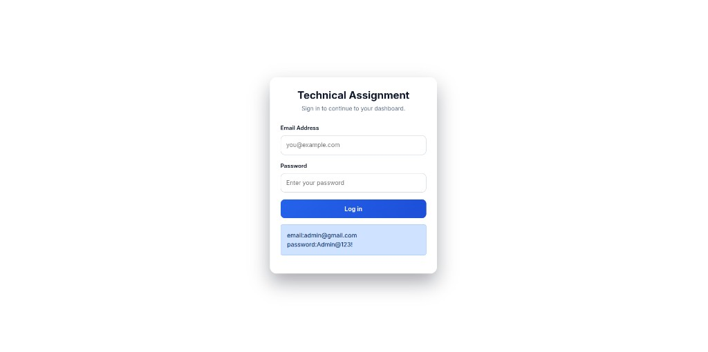
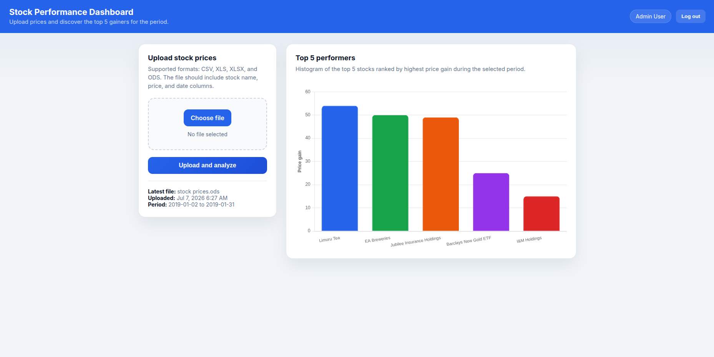

# Stock Performance Dashboard

A Laravel web application for the WizGlobal technical assignment. Users can log in, upload stock price files (CSV, XLS, XLSX, or ODS), and view a chart of the **top 5 best performers** for the selected period.

Performance is calculated as the **highest price gain during the period**: for each stock, the system finds the maximum value of `current price − lowest price seen so far` across all dates in the file.

---

## Screenshots

### Login page

Sign in with the seeded demo credentials to access the dashboard.



**Demo credentials:** `admin@gmail.com` / `Admin@123!`

### Dashboard

Upload a stock price file and view the top 5 performers as a histogram, ranked by highest price gain during the period.



---

## Tech stack

| Item | Version / package |
|------|-------------------|
| **PHP** | `^8.3` (8.3 or higher) |
| **Laravel** | `^13.8` (installed: **13.18.1**) |
| **Database** | SQLite, MySQL, or PostgreSQL |
| **Excel/CSV parsing** | [maatwebsite/excel](https://github.com/SpartnerNL/Laravel-Excel) `^3.1` |
| **Charts** | [Chart.js](https://www.chartjs.org/) 4.x (CDN) |
| **Frontend build** | Vite 8, Tailwind CSS 4 (optional for asset pipeline) |

### Main Composer packages

```json
"php": "^8.3",
"laravel/framework": "^13.8",
"laravel/tinker": "^3.0",
"maatwebsite/excel": "^3.1"
```

---

## Prerequisites

Before you begin, make sure you have:

- **Git**
- **PHP 8.3+** with extensions: `mbstring`, `openssl`, `pdo`, `tokenizer`, `xml`, `ctype`, `json`, `fileinfo`
- **PDO driver for your database** (install the one matching `DB_CONNECTION`):
  - SQLite: `pdo_sqlite` (often included with PHP)
  - MySQL: `pdo_mysql`
  - PostgreSQL: `pdo_pgsql`
- **Composer** 2.x
- **Node.js** 18+ and **npm** (optional; only needed if you run the Vite asset pipeline)
- **MySQL 8+** or **PostgreSQL 15+** (optional; SQLite works out of the box)

Check your versions:

```bash
php -v
composer -V
node -v
php -m | grep pdo    # confirm pdo_sqlite, pdo_mysql, and/or pdo_pgsql
```

---

## Installation (from git clone to running app)

### 1. Clone the repository

```bash
git clone https://github.com/Mitchellesweetie/technical_assignmet2.git
cd technical_assignmet2
```

### 2. Install PHP dependencies

```bash
composer install
```

### 3. Create the environment file

```bash
cp .env.example .env
```

### 4. Generate the application key

```bash
php artisan key:generate
```

### 5. Configure environment variables

Open `.env` and set the values below.

#### Application

```env
APP_NAME="Stock Performance Dashboard"
APP_ENV=local
APP_DEBUG=true
APP_URL=http://localhost:8000
```


#### Database

Set `DB_CONNECTION` to `sqlite`, `mysql`, or `pgsql`. Make sure PHP has the matching PDO driver installed (`pdo_sqlite`, `pdo_mysql`, or `pdo_pgsql`). Check with:

```bash
php -m | grep pdo
```

**MySQL example:**

```env
DB_CONNECTION=mysql
DB_HOST=127.0.0.1
DB_PORT=3306
DB_DATABASE=technical_assignment2
DB_USERNAME=root
DB_PASSWORD=your_password
```

Create the database in MySQL before migrating:

```sql
CREATE DATABASE technical_assignment2;
```

**PostgreSQL example:**

```env
DB_CONNECTION=pgsql
DB_HOST=127.0.0.1
DB_PORT=5432
DB_DATABASE=technical_assignment2
DB_USERNAME=your_pg_user
DB_PASSWORD=your_password
```

Create the database in PostgreSQL before migrating:

```sql
CREATE DATABASE technical_assignment2;
```

**SQLite example** (no server required):

```env
DB_CONNECTION=sqlite
# DB_DATABASE is optional; defaults to database/database.sqlite
```

#### Session and cache (recommended defaults)

These are already set in `.env.example` and should work after migration:

```env
SESSION_DRIVER=database
CACHE_STORE=database
QUEUE_CONNECTION=database
```

### 6. Run database migrations

```bash
php artisan migrate
```

This creates:

- `users` — login accounts
- `stock_uploads` — uploaded file metadata
- `stock_prices` — parsed stock price rows
- `sessions`, `cache`, `jobs` — Laravel system tables

### 7. Seed the database

Seed demo users with:

```bash
php artisan db:seed
```

Or seed only users:

```bash
php artisan db:seed --class=UserSeeder
```

#### Seeded accounts

| Name | Email | Password |
|------|-------|----------|
| Admin User | `admin@gmail.com` | `Admin@123!` |
| Student User | `student@gmail.com` | `Student@123!` |

The seeder uses `updateOrCreate`, so it is safe to run multiple times.

### 8. Start the application

```bash
php artisan serve
```

Open in your browser:

**http://localhost:8000**

---

## Quick setup (one command)

If dependencies are not installed yet, you can use the Composer setup script:

```bash
composer run setup
php artisan db:seed
php artisan serve
```

`composer run setup` runs: `composer install`, copies `.env`, generates the app key, runs migrations, and builds frontend assets.

---

## How to use the application

1. Go to **http://localhost:8000**
2. Log in with one of the seeded accounts (see table above)
3. On the dashboard, upload a stock price file (CSV, XLS, XLSX, or ODS)
4. View the **Top 5 performers** histogram and summary cards

### Expected file format

The file must contain three columns: **stock**, **price**, and **date**.

```csv
stock,price,date
Eaagads Ltd,14.5,2019-01-02
Limuru Tea,500,2019-01-03
EA Breweries,173.5,2019-01-02
```

- Column headers are optional
- Supported date format: `YYYY-MM-DD` (Excel serial dates are also supported for spreadsheet uploads)
- Maximum upload size: 10 MB

---

## Performance calculation

For each company (`stock_name`):

1. Prices are sorted by date
2. A running minimum price is tracked
3. Daily gain = `current price − running minimum`
4. **Max price gain** = highest daily gain during the period
5. Companies are ranked by max price gain; the top 5 are shown on the chart

Example: if prices go `100 → 80 → 120`, the highest gain is **40** (buy at 80, sell at 120).

---

## Design decisions

### What the data represents

Each row in the uploaded file is a **daily share price** for one company. Together, the records show how each stock moved over time. This type of data is often used for trend analysis, forecasting, visualization, and financial reporting.

### How do we decide which stock is "topping"?

There is no single correct answer — it depends on what you measure.

| Approach | What it measures | Example (Jan 2019) |
|----------|------------------|---------------------|
| **Highest share price** | Which stock trades at the highest absolute price | **Limuru Tea** (KSh 500 → 554) |
| **Percentage return** | Relative growth, regardless of price level | **Umeme Holdings** (~24%: KSh 7.00 → 8.70) vs Limuru Tea (~10.8%) |
| **Highest price gain (this app)** | Best gain achievable during the period if you bought at the lowest point before selling | **Limuru Tea**, **EA Breweries**, etc. |

A higher share price does **not** always mean a better investment. Real decisions would also consider volume, profitability, dividends, volatility, and market cap. This assignment focuses on one clear rule from the brief: **highest price gain during the period**.

### Why this app uses "highest price gain"

The assignment asks for the top performers based on the **highest price gain during the period**, not:

- the highest absolute price (Limuru Tea would always win because its price is in the hundreds), or
- simple start-to-end percentage return (which ignores better buy/sell points within the month).

Instead, for each stock the app:

1. walks through prices in date order,
2. tracks the lowest price seen so far,
3. calculates how much gain was possible at each day,
4. keeps the **maximum** of those gains.

That rewards stocks that had the biggest recoveries or rallies during January 2019 — for example a move from a local low to a later high — even if the stock dipped in between.

### Example from the dataset

- **Limuru Tea** — high absolute price (KSh 500–554) and strong gain; ranks near the top.
- **Umeme Holdings** — much lower price (KSh ~7–8.7) but strong **percentage** growth (~24%).
- **EA Breweries** — large absolute gain during the month (sharp rise late in January).

So:

- For **highest share price** → Limuru Tea.
- For **percentage growth** → compare % change; Umeme Holdings looks stronger on that basis.
- For **this assignment** → rank by **max price gain during the period** (what the histogram shows).
Therefore using **Highest stock price mthod** for this analys instead of **investment growth method**.With **Limuru Tea** and the other top 5 having the high value stability

### UI and technical choices

- **Login** — simple session auth so uploads are tied to a user.
- **File upload** — CSV, XLS, XLSX, ODS via `maatwebsite/excel` so assessors can use Excel exports as-is.
- **Histogram** — bar chart of the top 5 gains; easier to compare performers at a glance than a multi-line time series.
- **Summary cards** — show gain amount and percentage for quick context alongside the chart.

---

## Testing

The project includes **PHPUnit** tests for core assignment logic and authentication. Tests run against an in-memory **SQLite** database (configured in `phpunit.xml`) — no separate test database setup is required.

### Run tests

```bash

php artisan test

# Unit tests only (services)
php artisan test tests/Unit

# Feature tests only (HTTP / login flow)
php artisan test tests/Feature

# Single file
php artisan test tests/Unit/TopPerformersAnalyzerTest.php
php artisan test tests/Feature/LoginTest.php

# Single test method
php artisan test --filter test_it_ranks_stocks_by_max_price_gain
```

### What is covered

| Test | Type | What it verifies |
|------|------|------------------|
| `TopPerformersAnalyzerTest` | Unit | Stocks ranked by max price gain; only top 5 returned |
| `StockFileParserTest` | Unit | Valid CSV parsing; invalid price rejected |
| `LoginTest` | Feature | Login succeeds with valid credentials; fails with invalid credentials |


## Useful Artisan commands

| Command | Description |
|---------|-------------|
| `php artisan test` | Run all unit and feature tests |
| `php artisan test tests/Unit` | Run unit tests only |
| `php artisan test tests/Feature` | Run feature tests only |
| `php artisan migrate` | Run database migrations |
| `php artisan migrate:fresh` | Drop all tables and re-run migrations |
| `php artisan db:seed` | Seed demo users |
| `php artisan migrate:fresh --seed` | Reset DB and seed in one step |
| `php artisan serve` | Start local dev server |
| `php artisan config:clear` | Clear cached config after `.env` changes |

---

## Project structure

```
app/
├── Http/Controllers/
│   ├── AuthenticationController.php   # Login & logout
│   └── StockController.php            # Upload & dashboard
├── Models/
│   ├── StockUpload.php
│   └── StockPrice.php
└── Services/
    ├── StockFileParser.php            # CSV / Excel / ODS parsing
    └── TopPerformersAnalyzer.php      # Top 5 ranking & chart data

database/
├── migrations/                        # users, stock_uploads, stock_prices
└── seeders/
    ├── DatabaseSeeder.php
    └── UserSeeder.php                 # Demo login accounts

resources/views/
├── login.blade.php
└── dashboard.blade.php                # Upload form + Chart.js histogram

routes/web.php                         # Application routes

tests/
├── Unit/
│   ├── TopPerformersAnalyzerTest.php  # Max price gain & top 5 logic
│   └── StockFileParserTest.php        # CSV parsing & validation
└── Feature/
    └── LoginTest.php                  # Login success & failure
```

---

## Routes

| Method | URL | Description |
|--------|-----|-------------|
| GET | `/` | Login page |
| POST | `/auth/login` | Submit login |
| POST | `/auth/logout` | Log out |
| GET | `/dashboard` | Dashboard (auth required) |
| POST | `/upload` | Upload stock file (auth required) |

---

## Troubleshooting

### `SQLSTATE[HY000] [2002] Connection refused`

The database server is not running or `.env` settings are wrong. Either:

- Start MySQL/PostgreSQL and verify `DB_HOST`, `DB_PORT`, `DB_DATABASE`, `DB_USERNAME`, `DB_PASSWORD`, or
- Switch to SQLite (set `DB_CONNECTION=sqlite` in `.env`)

### `could not find driver`

PHP is missing the PDO extension for your database. Install the matching driver (`pdo_mysql` or `pdo_pgsql`) and restart your web server or `php artisan serve`.

### `Base table or view not found`

Run migrations:

```bash
php artisan migrate
```

### Login fails after fresh install

Seed the users:

```bash
php artisan db:seed
```

### Changes to `.env` not applied

```bash
php artisan config:clear
```

---

## License

This project is built on the [Laravel](https://laravel.com) framework, which is open-sourced software licensed under the [MIT license](https://opensource.org/licenses/MIT).
